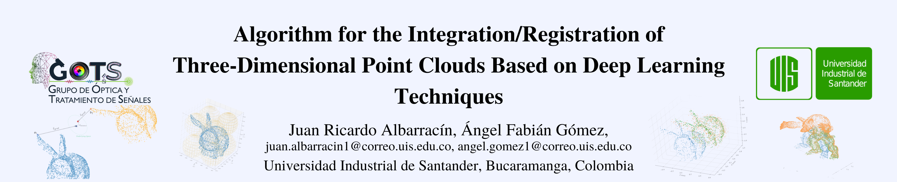

# DeepRegistrationPointCloudAlgorithm
Algoritmo para la integración/registro de nubes de puntos tridimensionales basado en técnicas de aprendizaje profundo.

#

Con el continuo desarrollo de las técnicas de reconstrucción tridimensional (3D) y el aumento de las aplicaciones en diferentes ramas de la ciencia en las que esta tecnología puede tener cabida, han surgido multitud de metodologías que intentan solucionar los problemas de registrar y alinear nubes de puntos ubicadas en posiciones aleatorias o cuando no tienen una estimación de la transformación que los diferencia. En este proceso de reconstrucción 3D, después de escanear u obtener datos desde diferentes puntos de vista, uno de los principales desafíos es establecer los puntos correspondientes entre las diferentes capturas para alinear correctamente ese par de nubes de puntos (integración o registro) en base a un mismo sistema de referencia. Es necesario ajustar y alinear las nubes de puntos correspondientes a los escaneos del objeto o escena en cuestión para poder realizar la reconstrucción o digitalización para cual sea su aplicación.  En este trabajo de investigación se propone un algoritmo que involucra técnicas de Aprendizaje Profundo para obtener un correcto registro de nubes de puntos capturadas en ambientes de oclusión, alta reflectancia y datos faltantes.

